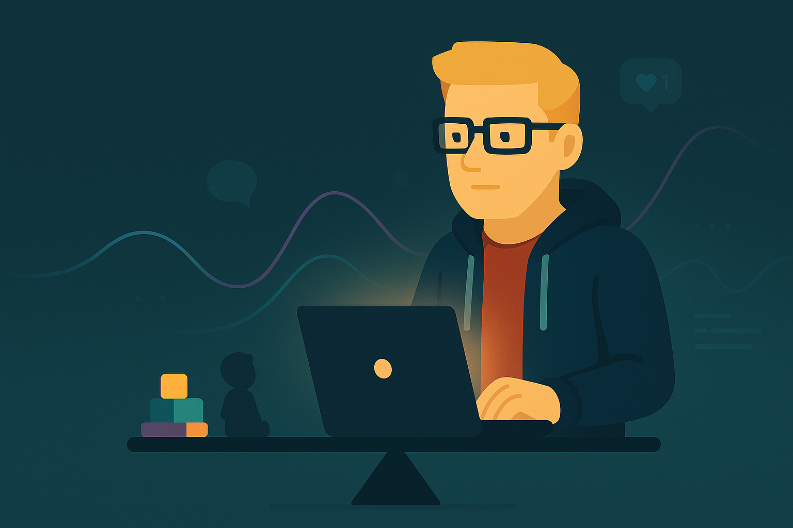

AI has transformed the way I work. It has also made me confront a harder question for me: what does a healthy balance look like in my life when the pace of change feels relentless and the fear of missing out is always whispering in my ear?

*This piece follows [The AI Coding Revolution: Magic or Mirage?](/posts/agentic-reflections/). Consider it a part two: where I am now, a personal note on what has changed for me.*

## How I Got Here

Computers have been a hobby since I was a child and they still are. Over time that hobby became a career. I started out in web development, then moved into mobile, and I love it. Once it became my job, the hobby slowly moved into the background. I love my work, but a full day is taxing. When the day ends, I do not have the capacity or inclination to start personal projects. I rarely began them and almost never finished. Over time my priorities and energy shifted, and family life arrived. 

Then AI shifted my world. Tools like ChatGPT and Claude Code rebuilt my motivation. I found myself crossing domain boundaries I would normally avoid. I learned enough Node and TypeScript to be dangerous. I spun up EKS on dedicated servers just to see if I could. None of this was required by my day job. AI made it feel possible and fun again by lowering the barrier to building outside my area of expertise.

## From Code To Product

I have always cared most about the product. In my early days playing with Visual Basic, I would drag buttons onto forms and design menus for hours. The code could wait. That instinct never really left. AI has let me lean into it: less time wrestling with glue code and more time focusing on what the thing should do.

It has also helped me keep momentum. Instead of procrastinating over code details, I can focus on shaping the product and actually deliver something tangible.

This is how I ended up building XcodeBuildMCP. Without AI, I doubt I would have attempted it. With AI, it felt achievable. The project found its audience and took off in a way I did not expect. I have also built smaller tools like Reloaderoo and AXe. None of this would have happened without the AI boost.

## Momentum Becomes A Habit

Success brings momentum. Momentum becomes habit. For months I worked most evenings after the kids went to bed: three hours on the sofa, laptop open, TV on in the background, iterating on the next feature or bug fix. Weekends crept in too. I would ask my wife to take the kids out so I could “just finish something”.

> "Each release delivered a small dopamine hit. Likes on Twitter, stars on GitHub, messages from people using the tools. It felt great. It also kept me glued to the screen."

## Productivity Is Not Time Back

People talk about AI making us more productive. In my case, it did—and it also encouraged doing more. I found myself running multiple threads of work in parallel because I could. The result for me was not free time. It was more throughput. That can be exciting. It can also be exhausting.

## The FOMO Trap

This is where fear of missing out crept in. The space moves quickly. New models, new clients, new techniques. I wanted to stay on the right side of this shift, not wake up one day feeling left behind or out of step. That thought pattern, for me, justified never putting the laptop down. There was always one more idea to try, feature to work on, or something to read and learn about.

I wrote earlier about the personal cost of agentic workflows in [that reflection](/posts/agentic-reflections/). The short version: I traded hands-on coding for the constant coordination of AI. My evenings became agent supervision. The urge to keep up never really sleeps when the timeline is always refreshing. If you read that first, this will feel like the next chapter of the same tension, with me trying firmer stop times and clearer lines around when I work and when I do not.

## The Cost I Was Not Willing To Pay

I have two young children. They are seven and five. This is a precious stage for them and for me. I started to feel guilty about the weekends I spent building features and chasing the next update, and the evenings where I chose a build over bedtime stories. That was my cue to change.

> "I want to be part of the AI future. I do not want to miss my children’s present."

## Choosing Balance On Purpose

About a month ago I made a simple change: if I am not in the mood to work after work, I do not. No negotiation. No “quick check”. I recently took a full weekend offline with the kids at Legoland. I did not open the laptop once. I felt better for it. The work was still there on Monday. The world did not move on without me.

As I wrote this, my kids popped in to ask for my attention and I caught myself about to ask them to wait so I could finish a paragraph. That moment sums up the instinct I am trying to change.

This is not advice. It is just what I needed. I am learning my limits and respecting them. I want to be proud of the things I build and proud of how I spent my time building them.

## What Balance Looks Like For Me Now

This is a work in progress for me. I am not there yet, and I still slip up.

- **Evenings**: I no longer work every night. If I am tired or not in the mood, I close the laptop and do something else. Some nights I still code.
- **Weekends**: I am working significantly less. I am practising letting go of FOMO when I choose time with my family over a release or a model drop.
- **Family**: I want this to be the priority. I still sometimes choose an extra hour on a project over an hour with my kids. I am trying to catch that sooner and change course.
- **Outside and fitness**: This is the biggest deficit. I am still not outside enough, and I turn down seeing friends at times to push an AI project. I am starting to change that.

None of this is a rulebook. It is just what I am trying right now.

## Where I Am Landing

I am extremely optimistic and excited about AI. It lowers the barrier to entry for anyone to experiment, build, and be creative, which is the part of software I love most. It has also shown me that productivity without boundaries is a trap for me. This is not only about children. Even without kids, I would still need limits for my physical and mental health. For me, balance does not happen by accident. I have to choose it.

This is an anecdote, not a conclusion. I am not making a statement about what others should do. Some people thrive in the deep end and create extraordinary things. I enjoy watching that. I just know that for me, right now, the right move is to build at a sustainable pace and to be present with my family.

If that means I miss a few waves, so be it. There will be more. My children will only be this age once.
