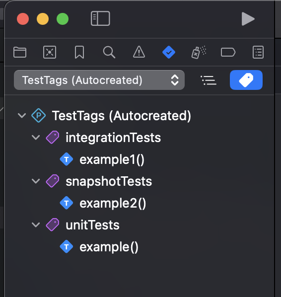
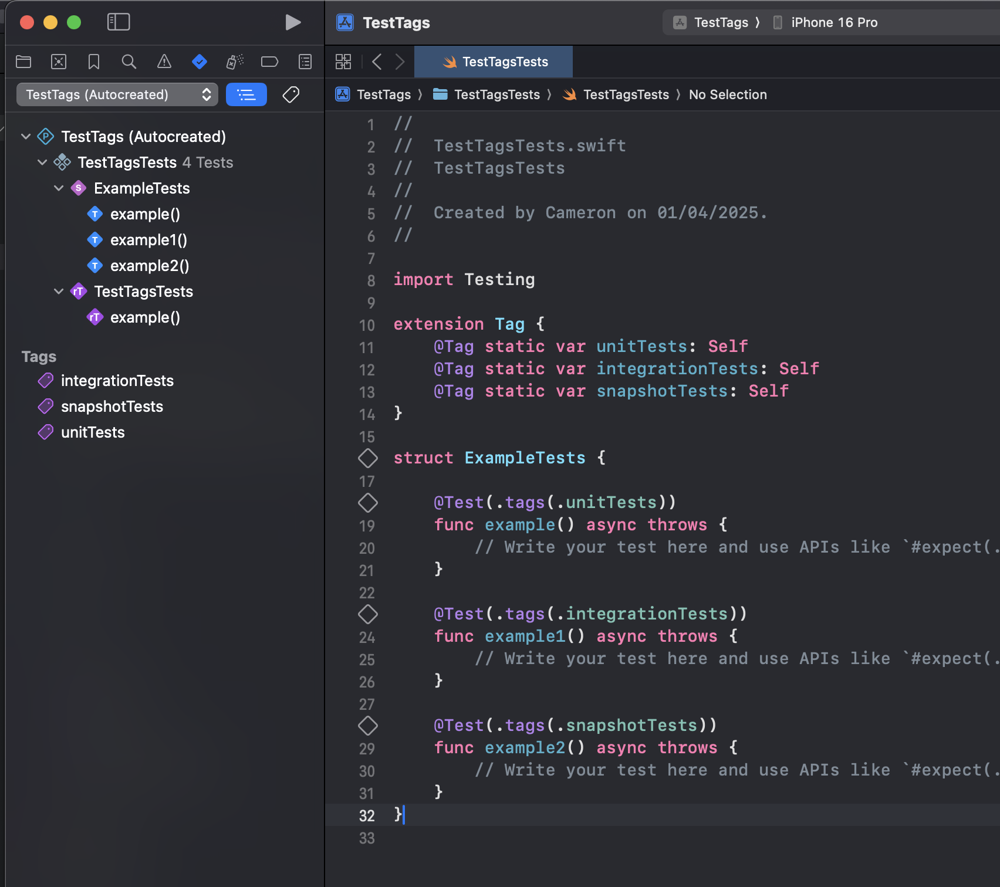

The Swift Testing framework includes a powerful yet often overlooked feature: Tags. This simple addition can transform how you organise tests in projects of any size.

## What Are Tags in Swift Testing?

Tags are essentially labels you can attach to test methods, allowing you to categorise and filter them when running your test suite. This becomes invaluable when managing different types of tests that you might want to execute separately—such as unit tests during development or integration tests that run before your PR is merged.

## Creating Custom Tags

Creating your own tags is straightforward. Simply extend the `Tag` type with your custom categories:

```swift
import Testing

extension Tag {
    @Tag static var unitTests: Self
    @Tag static var integrationTests: Self
    @Tag static var snapshotTests: Self
}
```
The `@Tag` attribute informs the Swift Testing framework that these are tag definitions, creating three distinct categories you can use throughout your test suite.

## Applying Tags to Tests

Once defined, you can apply tags to individual test methods using the `.tags()` parameter of the @Test macro:

```swift
struct ExampleTests {

    @Test(.tags(.unitTests))
    func example() async throws {
        // Unit test implementation
    }
    
    @Test(.tags(.integrationTests))
    func example1() async throws {
        // Integration test implementation
    }
    
    @Test(.tags(.snapshotTests))
    func example2() async throws {
        // Snapshot test implementation
    }
}
```
## Visual Organisation in Xcode

One immediate benefit is how Xcode's test navigator automatically groups tests by their tags, making it significantly easier to locate and run specific test categories.



## Running Tests by Tag

The real advantage comes when you need to run only a subset of your tests. During development, you might want to focus on just the unit tests (which typically run faster) and save integration tests for your CI pipeline.



Simply select a tag group in the test navigator to run all tests with that specific tag.

## Advanced Tag Usage

Tags can be combined for more sophisticated scenarios:

```swift
@Test(.tags(.unitTests, .critical))
func importantBusinessLogicTest() async throws {
    // Test critical business logic
}
```
This approach lets you create layered categorisations that can be extremely useful in complex projects.

## Integrating Tags with CI Workflows

As of Xcode 16.3, `xcodebuild` supports filtering tests by tags, making it easy to automate different test runs in your CI pipeline:

```bash
# Run only tests with specific unitTests tag
xcodebuild test -only-testing-tags unitTests -scheme MyScheme -destination 'platform=iOS Simulator,id=<simulator_id>'

# Run all tests except those with integrationTests and snapshotTests tags
xcodebuild test -skip-testing-tags integrationTests,snapshotTests -scheme MyScheme -destination 'platform=iOS Simulator,id=<simulator_id>'
```
## Wrapping Up

Tags in the Swift Testing framework offer a flexible solution for organising your test suite that scales with your project and can help keep your CI workflows streamlined. Read more about the new tags feature in the [Adding tags to tests @ Apple Developer](https://developer.apple.com/documentation/Testing/AddingTags).
