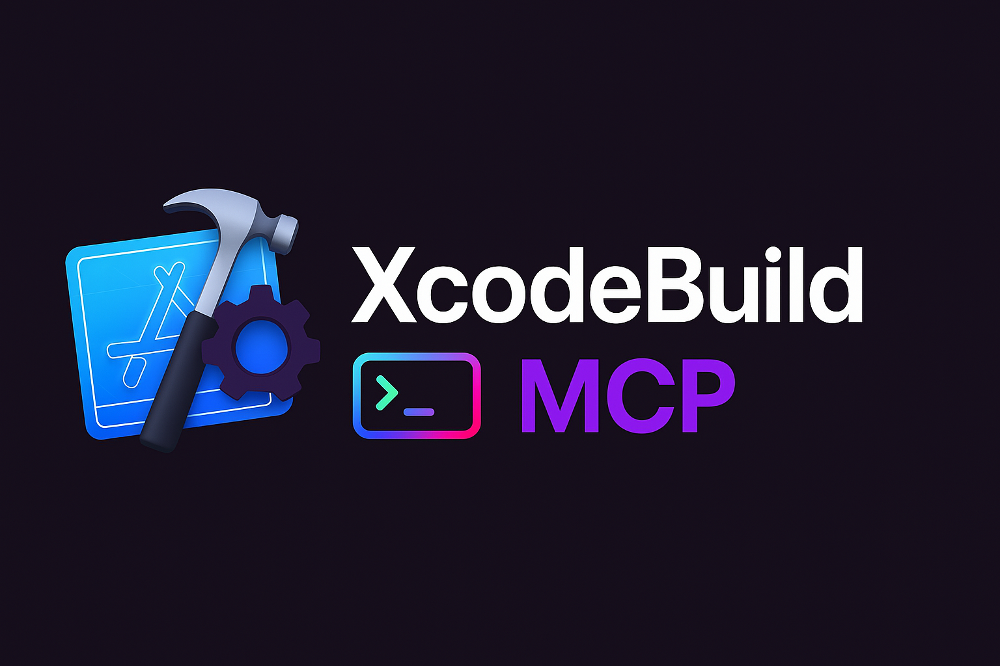

Since my [last update about UI automation](/posts/xcodebuild-ui-automation/), XcodeBuild MCP has evolved significantly. Three major capabilities now shape what AI agents can achieve with Swift projects: project scaffolding for creating apps from scratch, comprehensive Swift Package Manager integration, and a redesigned UI automation system powered by AXe.

## Project Scaffolding: From Zero to App

The new scaffolding tools address a fundamental gap in agent-driven development: creating projects from scratch. Previously, agents could only work with existing codebases. Now they can generate complete iOS and macOS projects:

- **Generate project structures** with sensible defaults for different app types
- **Configure build settings** appropriately for iOS, macOS, and framework targets
- **Set up folder hierarchies** following Apple's established conventions
- **Apply templates** that stay current through GitHub release distribution

When you ask an agent to "Create a new iOS app with SwiftUI," it can now deliver a complete, buildable project without any manual intervention. The templates live in external repositories, downloaded on-demand and cached locally, which keeps the core tool lightweight while ensuring templates reflect current best practices.

<video width="100%" controls>
  <source src="https://media.async-let.com/project-scaffolding-demo.mp4" type="video/mp4">
  Your browser does not support the video tag.
</video>

## Swift Package Manager: Beyond Dependencies

Swift Package Manager has become central to modern Swift development, yet most tooling still assumes Xcode project files. XcodeBuild MCP now provides comprehensive SPM support that goes well beyond dependency management:

- **Build and test** Swift packages directly using `swift build` and `swift test`
- **Execute package products** with proper argument passing and environment control
- **Clean build artifacts** selectively or completely
- **Inspect package structure** to understand available products and targets
- **Manage running processes** with lifecycle controls for long-running executables

This enables agents to work with pure Swift Package projects that have no `.xcodeproj` file. Whether you are building command-line tools, libraries, or even server-side Swift applications, agents can now handle the complete development workflow without requiring traditional Xcode project structures.

## UI Automation Remastered with AXe

The UI automation capabilities have graduated from beta with a complete architectural overhaul. I replaced the previous multi-dependency approach with [AXe](https://github.com/cameroncooke/AXe), a purpose-built CLI tool that solves the complexity problem head-on:

- **Single binary dependency**: No more coordinating Python environments, Homebrew packages, and multiple system requirements
- **Direct CLI integration**: Eliminates client-server complexity that often caused reliability issues
- **Rich gesture vocabulary**: Built-in support for common iOS patterns like edge swipes, multi-touch gestures, and precise scrolling
- **Configurable timing**: Fine-tune delays and durations for complex UI sequences that depend on animations
- **Coordinate intelligence**: Helper functions that understand iOS screen layouts and common UI element positioning

The difference is architectural: where the previous solution required agents to orchestrate multiple tools, AXe provides a unified interface specifically designed for programmatic control. This makes UI automation more reliable and significantly easier to integrate with other development tooling.

<video width="100%" controls>
  <source src="https://media.async-let.com/axe-demo.mp4" type="video/mp4">
  Your browser does not support the video tag.
</video>

## Behind-the-Scenes Improvements

### Incremental Builds Save Time

Large Swift projects can take significant time to build repeatedly during development. The new experimental incremental build support addresses this by only recompiling changed sources. Early testing shows build time reductions of up to 70% for typical iterative development workflows.

### Selective Tool Control

Different development environments have different security and complexity requirements. You can now control exactly which capabilities are available to agents using environment variables:

```json
{
  "mcpServers": {
    "XcodeBuildMCP": {
      "command": "npx",
      "args": ["-y", "xcodebuildmcp@latest"],
      "env": {
        "XCODEBUILDMCP_DISABLE_UI_AUTOMATION": "true"
      }
    }
  }
}
```
This is particularly useful in team environments where you might want UI automation disabled but still allow build and test operations.

### Editor Integration

Some AI-powered editors now provide direct installation support, though the standard `npx` approach remains the most reliable:

[](https://cursor.com/install-mcp?name=XcodeBuildMCP&config=eyJjb21tYW5kIjoibnB4IC15IHhjb2RlYnVpbGRtY3BAbGF0ZXN0In0%3D)
[](https://insiders.vscode.dev/redirect/mcp/install?name=XcodeBuildMCP&config=%7B%22command%22%3A%22npx%22%2C%22args%22%3A%5B%22-y%22%2C%22xcodebuildmcp%40latest%22%5D%7D)
[](https://insiders.vscode.dev/redirect/mcp/install?name=XcodeBuildMCP&config=%7B%22command%22%3A%22npx%22%2C%22args%22%3A%5B%22-y%22%2C%22xcodebuildmcp%40latest%22%5D%7D&quality=insiders)

## Installation Evolution: From mise to npx

I previously recommended using `mise` for installation, which required version management and local binaries. The current approach uses `npx` for a simpler setup that eliminates version management entirely:

```json
{
  "mcpServers": {
    "XcodeBuildMCP": {
      "command": "npx",
      "args": ["-y", "xcodebuildmcp@latest"]
    }
  }
}
```
Why the change? The `npx` approach solves several practical problems:
- **Automatic updates**: You always get the latest published version without manual intervention
- **No local state**: Runs directly from the npm registry without cluttering your system
- **Simplified maintenance**: Eliminates the need to track and update tool versions
- **Cleaner setup**: No build steps, compilation, or dependency resolution required

If you prefer version pinning or have specific deployment requirements, the traditional installation methods remain available. The [GitHub README](https://github.com/cameroncooke/XcodeBuildMCP) documents all supported approaches.

## System Requirements

The latest features require updated system dependencies:

- **macOS 14.5+** (increased from 14.0 for better Simulator support)
- **Xcode 16.x** (current stable release)
- **Node.js 18.x** (increased from 16.x for modern npm features)
- **AXe 1.0.0** (optional, required only for UI automation capabilities)

## Looking Forward

XcodeBuild MCP now spans the complete iOS development lifecycle: from initial project creation through building, testing, and UI verification. The combination of project scaffolding, comprehensive Swift Package Manager support, and simplified UI automation represents a substantial step forward in what AI agents can accomplish with Swift projects.

These capabilities open new possibilities for agent-driven development workflows that I am eager to explore further. If you experiment with these features, I would welcome your feedback and contributions on [GitHub](https://github.com/cameroncooke/XcodeBuildMCP).

### Previous Updates

For the complete evolution of XcodeBuild MCP:
- [Introducing XcodeBuild MCP](/blog/xcodebuild-mcp/)
- [Project Discovery & Log Capture](/blog/xcodebuild-mcp_improvements/)
- [UI Automation](/blog/xcodebuild-ui-automation/)
