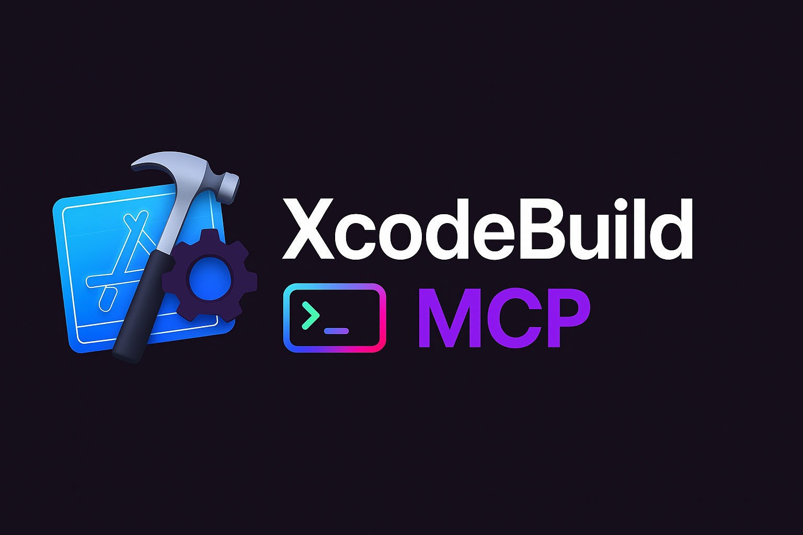

This post is a follow-up to my [original XcodeBuild MCP article](/posts/xcodebuild-mcp/), focusing on two new features aimed at improving the experience for AI agents working with Xcode projects.

## Project Discovery

Previously, when using tools that required a project or workspace path, agents would either try to guess the correct path or prompt the user for input even if the project was already open in the workspace. This often led to unnecessary interruptions or errors. With the new project discovery feature, XcodeBuild MCP now allows agents to automatically scan and identify all available `.xcodeproj` and `.xcworkspace` files on their own. This means agents can select the right project without any human input, making the workflow smoother and more autonomous.

## Run-Time Log Capture

Wouldn't it be cool if agents could help you diagnose and solve run-time issues?

Well now they can! With the new log capture feature, agents can now capture run-time logs generated by your iOS app as it runs in the simulator. This includes both console logs and structured logs (when using OSLog). By observing the logs produced while the user exercises different parts of the app, agents can diagnose issues more effectively and, in some cases, even suggest or apply fixes automatically.

### Demo

## Wrapping Up

Is there a killer feature you think would be useful for XcodeBuild MCP? Let me know by [opening an issue](https://github.com/cameroncooke/XcodeBuildMCP/issues/new) . If you want to read my original post for a full background on what XcodeBuild MCP is or how to get started, check it out [here](/posts/xcodebuild-mcp/) or if you just want to try it out, you can get it from [GitHub](https://github.com/cameroncooke/XcodeBuildMCP).
